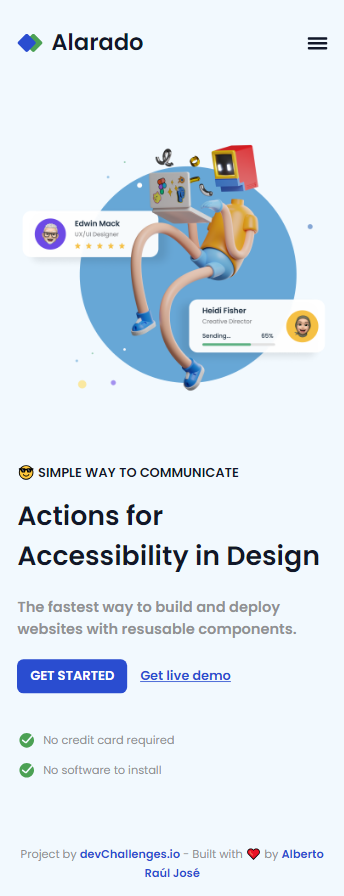
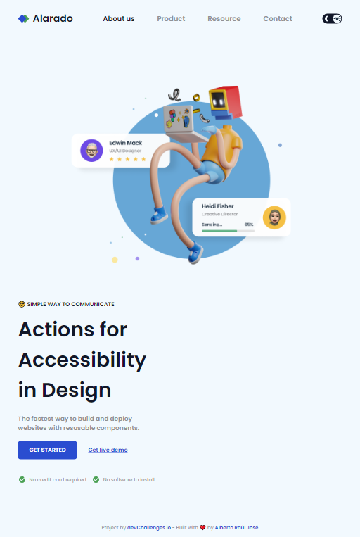
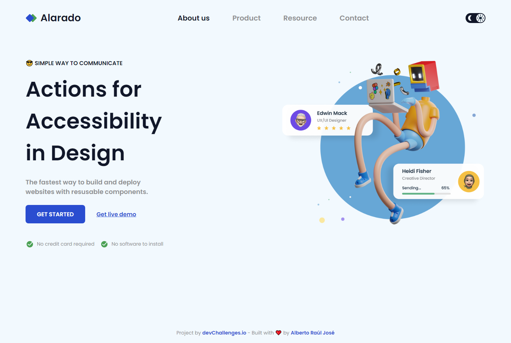

# Accessible home page

This is a [Responsive Web Developer Path Challenge](https://devchallenges.io/challenge/simple-homepage) from [deveChallenge.io](https://devchallenges.io)

Demo site: [Testimonial Page](https://alberto-rj.github.io/accessible-home-page/index.html)

  
Mobile Version

  

  
Tablet Version
 
  

  
Desktop Version
 
  

