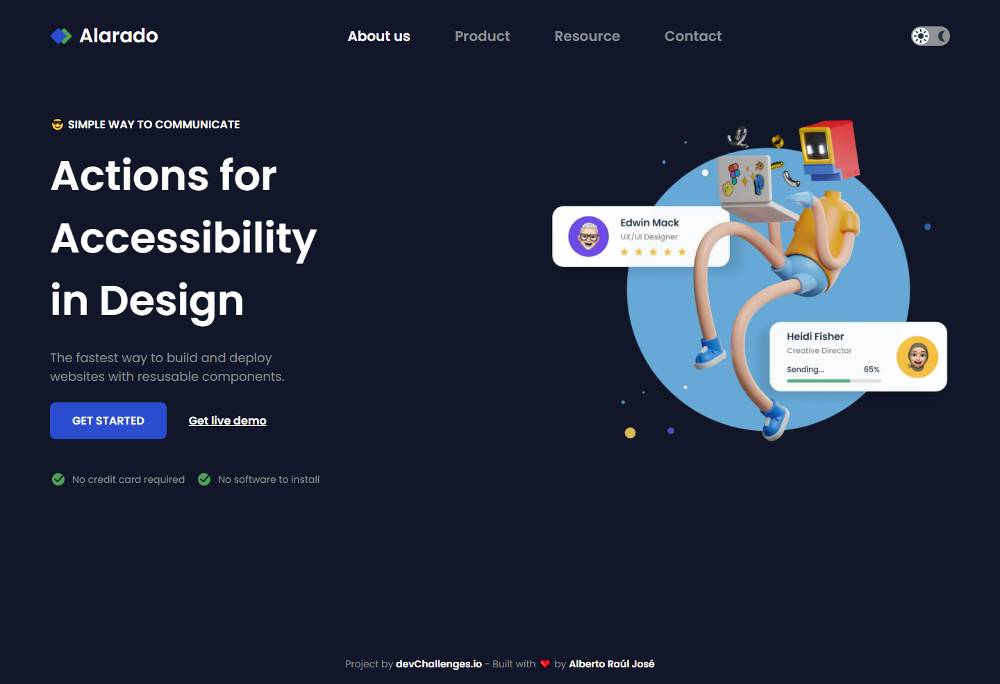
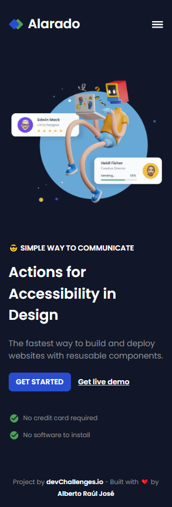
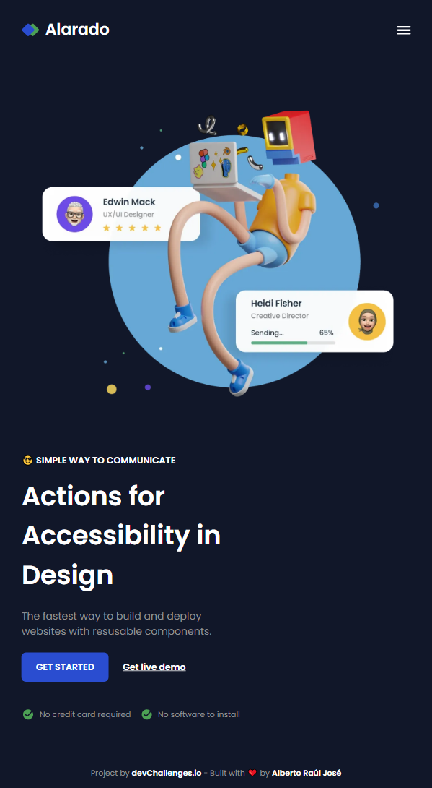

# Accessible homepage

This is a solution for [Responsive Web Developer Path Challenge](https://devchallenges.io/challenge/simple-hompage-alarado) from [deveChallenge.io](https://devchallenges.io)

Demo site: [Accessible Homepage](https://alberto-rj.github.io/accessible-homepage/index.html)

## Screenshot

### Dark Mode

  
Mobile Version

  

  
Tablet Version

  

  
Desktop Version

  

### Light Mode

  
Mobile Version

  

  
Tablet Version

  

  
Desktop Version

  

